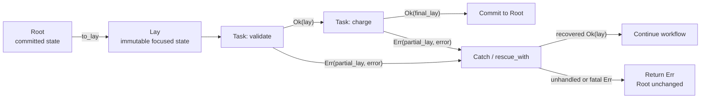

# Berylx

[](https://github.com/minamorl/berylx/actions/workflows/ci.yml)
[](https://www.ruby-lang.org/)

**Graphable Ruby workflows over focused, recoverable state.**

Berylx gives multi-step business workflows a small algebra without turning Ruby into a DSL:

```ruby
Task : Lay -> Result[Lay]
```

One `Root` owns committed state. Named tasks observe and immutably transform that state through
`Lay`. Every step returns `Ok(lay)` or `Err(partial_lay, error)`, so failures retain enough context
for diagnosis and compensation.



## Why Berylx?

- **One explicit boundary** — `Root` owns the committed state for a workflow run.
- **Focused immutable updates** — `Lay` reads and replaces nested values without shared mutation.
- **Failures keep their state** — compensation receives the partial `Lay`, not a trail of lost
  locals.
- **Composition stays small** — sequence, branch, parallel, merge, and rescue use Ruby operators and
  values.
- **The workflow is inspectable** — named tasks compile into graph objects and DOT output.

Berylx is in-process workflow composition—not a job queue, durable scheduler, or distributed saga
coordinator.

## Install

```ruby
gem 'berylx'
```

```ruby
require 'berylx'
```

Berylx requires Ruby 3.2 or newer and is tested through Ruby 4.0.

## Execution substrate

The surface API above is all you write. Under it, every workflow runs on a single substrate: the
[darkcore](https://github.com/minamorl/darkcore-ruby) Effect tree (a Freer monad). Berylx compiles
`Task`, sequence, parallel, branch, and rescue into one kind of tagged effect and interprets them
with `Berylx::EffectTree` on darkcore's trampoline. There is no second workflow representation.

Because execution is just an effect tree interpreted by a handler map, cross-cutting aspects (retry,
dry-run, audit) are added by **swapping the handler map** — the workflow itself is never rewritten.
`darkcore` is a required runtime dependency.

## Performance and the native bridge

The default (real) category has two evaluators with identical observable behavior:

- **Pure Ruby fold** — the reference implementation and single source of the semantics (`Task#call`
  envelope normalization, `recover`, parallel failure merging live here and only here).
- **`berylx_native` C bridge** — an accelerator that walks the same nodes iteratively and delegates
  every piece of berylx algebra back to the Ruby single source. It only takes over when the handler
  map is the default one; any swapped handler map (dry-run, audit, retry, your own category) runs on
  the pure Ruby fold as before.

The bridge compiles automatically on `gem install` (and via `rake compile` in development). If the
extension cannot be built or loaded, berylx falls back to pure Ruby silently; `BERYLX_NATIVE=0`
forces the fallback at runtime. A differential test suite (`test/native_equivalence_test.rb`) pins
both evaluators to structurally identical result envelopes across every combinator and failure path.

Measured on a 1000-step task chain with trivial bodies (`bench/bench.rb`, Ruby 3.3, no YJIT):

| engine                                         | time    | per step |
| ---------------------------------------------- | ------- | -------- |
| berylx ≤ 0.9 (left-associated bind, O(n²))     | 345 ms  | 345 µs   |
| berylx pure Ruby (right-associated bind, O(n)) | 3.4 ms  | 3.4 µs   |
| berylx + native bridge                         | 0.54 ms | 0.54 µs  |
| naive Freer in Rust, `--release` + LTO (O(n²)) | 7.5 ms  | 7.5 µs   |
| same O(n) Freer in Rust                        | 21 µs   | 21 ns    |
| direct walker in Rust (floor)                  | 1.4 µs  | 1.4 ns   |

Two honest readings (`bench/rust_baseline` reproduces the Rust rows, std-only):

- **The algorithm beats the language.** Berylx with the O(n) walk outruns the same naive-Freer
  design compiled in release-mode Rust by ~14× at n=1000, and the gap widens with n.
- **The language still sets the floor.** With the same O(n) algorithm on both sides, Rust remains
  ~25× faster per step; that residue is the cost of Ruby task semantics (`Task#call`), not of the
  bridge. For workflows whose task bodies do real work, orchestration is no longer the bottleneck.

## Quick start

Define named state transitions, compose them first, then run the complete workflow from the root:

```ruby
strip_name = Berylx::Task[:strip_name] do |lay|
  lay[:name].update(&:strip)
end

greet = Berylx::Task[:greet] do |lay|
  lay[:greeting].set("hello #{lay[:name].get}")
end

workflow = strip_name >> greet
root = Berylx::Root[name: '  mina  ']
result = root | workflow

result.focus.to_h
# => { name: 'mina', greeting: 'hello mina' }

root.state
# => { name: 'mina', greeting: 'hello mina' }
```

The whole sequence commits once because it ran as `root | workflow`. If any step returns `Err`, the
root stays at its last committed state while the result keeps the partial `Lay`.

## Failure and recovery at a glance

```ruby
charge = Berylx::Task[:charge] do |lay|
  lay[:charged].set(true).reject(:payment_failed, 'card declined')
end

notify = Berylx::Task[:notify] do |lay|
  lay[:notified].set(true)
end

workflow =
  charge >>
  Berylx::Catch[:record_failure] { |error, lay|
    lay[:failure].set(error.message)
  } >>
  notify

root = Berylx::Root[charged: false]
result = root | workflow

result.focus.to_h
# => { charged: true, failure: "card declined", notified: true }

root.state
# => { charged: true, failure: "card declined", notified: true }
```

Without the `Catch`, the result would be `Err` with `charged: true` in its partial lay, and
`root.state` would remain `{ charged: false }`.

## Documentation

| Guide                                         | What it covers                                                                            |
| --------------------------------------------- | ----------------------------------------------------------------------------------------- |
| [Root and Lay](docs/root-and-lay.md)          | State ownership, focus operations, commits, standalone lays, and subscriptions            |
| [Composing workflows](docs/workflows.md)      | Tasks, sequencing, branching, parallel execution, reducers, and graphs                    |
| [Errors and recovery](docs/error-handling.md) | Domain failures, raised exceptions, partial state, Catch, scoped rescue, and fatal errors |

Worked examples live in `examples/`: a Roda + Sequel checkout service (`roda_checkout_app.rb`), and
a signal-processing flow whose per-sample arithmetic runs at native speed through
[moissanite](https://github.com/minamorl/moissanite) kernels (`moissanite_signal_workflow.rb`).

## Native-level work inside a workflow

Berylx names the steps and owns the state; it deliberately says nothing about how a step does its
arithmetic. When a task's inner loop is the bottleneck, moissanite kernels — expression trees built
from Ruby values and lowered through the system C compiler — slot in as ordinary Task bodies:

```ruby
Condition = Berylx::Task[:condition] do |lay|
  out = Moissanite::Buffer.f64(lay[:count].get)
  CONDITION_KERNEL.call_parallel(out, lay[:samples].get, lay[:count].get)
  lay[:conditioned].set(out)
end
```

No adapter is involved and none is needed: a compiled kernel is just a callable. The effect tree
stays the linker, so retry, dry-run, and audit still arrive by swapping the handler map, and the
graph still compiles to DOT with the native step named like any other.

## When to use Berylx

Berylx fits checkout, onboarding, provisioning, API orchestration, and local saga-style flows where
steps have names, partial progress matters, and recovery should be visible in the workflow.

For a single method call or transaction, plain Ruby is probably clearer. For work that must survive
process restarts, use a durable workflow engine.

## License

MIT.
