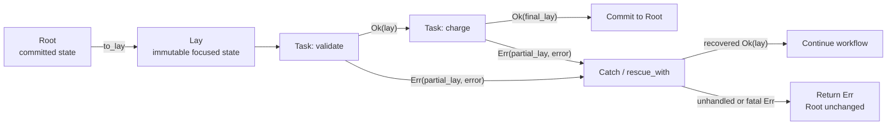

# Beryl

[](https://github.com/minamorl/beryl/actions/workflows/ci.yml)
[](https://www.ruby-lang.org/)

**Graphable Ruby workflows over focused, recoverable state.**

Beryl gives multi-step business workflows a small algebra without turning Ruby into a DSL:

```ruby
Task : Lay -> Result[Lay]
```

One `Root` owns committed state. Named tasks observe and immutably transform that state through
`Lay`. Every step returns `Ok(lay)` or `Err(partial_lay, error)`, so failures retain enough context
for diagnosis and compensation.



## Why Beryl?

- **One explicit boundary** — `Root` owns the committed state for a workflow run.
- **Focused immutable updates** — `Lay` reads and replaces nested values without shared mutation.
- **Failures keep their state** — compensation receives the partial `Lay`, not a trail of lost
  locals.
- **Composition stays small** — sequence, branch, parallel, merge, and rescue use Ruby operators and
  values.
- **The workflow is inspectable** — named tasks compile into graph objects and DOT output.

Beryl is in-process workflow composition—not a job queue, durable scheduler, or distributed saga
coordinator.

## Install

```ruby
gem 'beryl'
```

```ruby
require 'beryl'
```

Beryl requires Ruby 3.2 or newer and is tested through Ruby 4.0.

## Execution substrate

The surface API above is all you write. Under it, every workflow runs on a single substrate: the
[darkcore](https://github.com/minamorl/darkcore-ruby) Effect tree (a Freer monad). Beryl compiles
`Task`, sequence, parallel, branch, and rescue into one kind of tagged effect and interprets them
with `Beryl::EffectTree` on darkcore's trampoline. There is no second, native execution path.

Because execution is just an effect tree interpreted by a handler map, cross-cutting aspects (retry,
dry-run, audit) are added by **swapping the handler map** — the workflow itself is never rewritten.
`darkcore` is a required runtime dependency.

## Quick start

Define named state transitions, compose them first, then run the complete workflow from the root:

```ruby
strip_name = Beryl::Task[:strip_name] do |lay|
  lay[:name].update(&:strip)
end

greet = Beryl::Task[:greet] do |lay|
  lay[:greeting].set("hello #{lay[:name].get}")
end

workflow = strip_name >> greet
root = Beryl::Root[name: '  mina  ']
result = root | workflow

result.focus.to_h
# => { name: 'mina', greeting: 'hello mina' }

root.state
# => { name: 'mina', greeting: 'hello mina' }
```

The whole sequence commits once because it ran as `root | workflow`. If any step returns `Err`, the
root stays at its last committed state while the result keeps the partial `Lay`.

## Failure and recovery at a glance

```ruby
charge = Beryl::Task[:charge] do |lay|
  lay[:charged].set(true).reject(:payment_failed, 'card declined')
end

notify = Beryl::Task[:notify] do |lay|
  lay[:notified].set(true)
end

workflow =
  charge >>
  Beryl::Catch[:record_failure] { |error, lay|
    lay[:failure].set(error.message)
  } >>
  notify

root = Beryl::Root[charged: false]
result = root | workflow

result.focus.to_h
# => { charged: true, failure: "card declined", notified: true }

root.state
# => { charged: true, failure: "card declined", notified: true }
```

Without the `Catch`, the result would be `Err` with `charged: true` in its partial lay, and
`root.state` would remain `{ charged: false }`.

## Documentation

| Guide                                         | What it covers                                                                            |
| --------------------------------------------- | ----------------------------------------------------------------------------------------- |
| [Root and Lay](docs/root-and-lay.md)          | State ownership, focus operations, commits, standalone lays, and subscriptions            |
| [Composing workflows](docs/workflows.md)      | Tasks, sequencing, branching, parallel execution, reducers, and graphs                    |
| [Errors and recovery](docs/error-handling.md) | Domain failures, raised exceptions, partial state, Catch, scoped rescue, and fatal errors |

## When to use Beryl

Beryl fits checkout, onboarding, provisioning, API orchestration, and local saga-style flows where
steps have names, partial progress matters, and recovery should be visible in the workflow.

For a single method call or transaction, plain Ruby is probably clearer. For work that must survive
process restarts, use a durable workflow engine.

## License

MIT.
