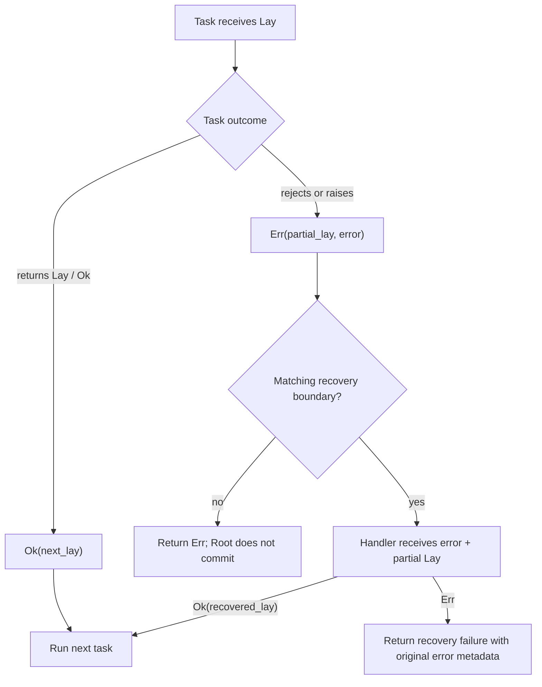

# Errors and recovery

Berylx keeps failure inside the workflow as `Err(partial_lay, error)`. This preserves state produced
before the failure and makes compensation an ordinary, visible part of composition.

## The error path



## Domain failures

Use `reject` for expected business failures:

```ruby
charge = Berylx::Task[:charge] do |lay|
  if card_declined?(lay)
    lay[:attempted].set(true).reject(:payment_failed, 'card declined')
  else
    lay[:charged].set(true)
  end
end
```

The returned `Err` exposes structured context:

```ruby
result.code
result.message
result.cause
result.failed_node
result.trace
result.parallel_errors
result.focus
```

Use `required` to turn a missing path into a domain error. It returns `Ok(focus)` when the path is
present and an `Err` with the given code when it is missing:

```ruby
result = lay[:account_id].required(:missing_account_id)
```

## Raised exceptions

A task catches `StandardError` and converts it into an `Err` while keeping the lay it received:

```ruby
explode = Berylx::Task[:explode] do |_lay|
  raise 'gateway timeout'
end

result = (mark_attempt >> explode).call(Berylx::Lay[])

result.code
# => :RuntimeError

result.focus.to_h
# => state returned by mark_attempt
```

When integration code needs exceptions again, call `unwrap`. If the error has an original Ruby
cause, that exception is raised; otherwise Berylx raises `Berylx::Error`.

## Short-circuiting

Ordinary sequence steps do not run after an `Err`:

```ruby
workflow = validate >> charge >> notify
```

If `validate` or `charge` fails, `notify` is skipped. The error flows forward unchanged unless the
sequence reaches a `Catch` that accepts it.

## Inline recovery with Catch

Place `Catch` where a sequence should be allowed to recover and continue:

```ruby
workflow =
  charge >>
  create_subscription >>
  Berylx::Catch[:refund] { |error, lay|
    lay[:refunded].set(error.message)
  } >>
  notify
```

The handler receives the error (or its original cause) and the partial lay. Returning a lay or `Ok`
marks the failure as recovered, so `notify` runs. Returning `Err` ends with the handler failure and
preserves the rescued error in metadata.

If no preceding step failed, `Catch` is skipped.

## Explicit rescue scopes

Use `rescue_with` when the protected body should be visually unambiguous:

```ruby
workflow =
  (charge >> create_subscription).rescue_with(:refund) do |error, lay|
    lay[:refunded].set(error.message)
  end >> notify
```

Only errors from the wrapped body reach that handler. Prefer this form for a deliberate compensation
boundary; prefer `Catch` when recovery reads naturally as one stage in a pipeline.

## Fatal errors

Fatal failures bypass ordinary recovery:

```ruby
stop = Berylx::Task[:stop] do |lay|
  Berylx::Result.err(
    lay[:stopped].set(true),
    :stop,
    'stop',
    fatal: true
  )
end

workflow =
  stop >>
  Berylx::Catch[:ordinary_recovery] { |_error, lay| lay[:recovered].set(true) }
```

The result remains the original fatal `Err`. A boundary must opt in explicitly to handle it:

```ruby
workflow =
  stop >>
  Berylx::Catch[:terminal_recovery, fatal: true] { |error, lay|
    lay[:recovered].set(error.message)
  }
```

Use fatal recovery sparingly; terminal errors are conservative by default.

## Root behavior on failure

A root commits only `Ok`:

```ruby
root = Berylx::Root[charged: false]
result = root | charge
```

If `charge` returns an unrecovered `Err`, `result.focus` contains its partial state but `root.state`
is unchanged. If a handler recovers and the complete workflow returns `Ok`, the recovered final lay
is committed.

This separation is the central guarantee: failure state remains available as data without silently
becoming committed application state.
