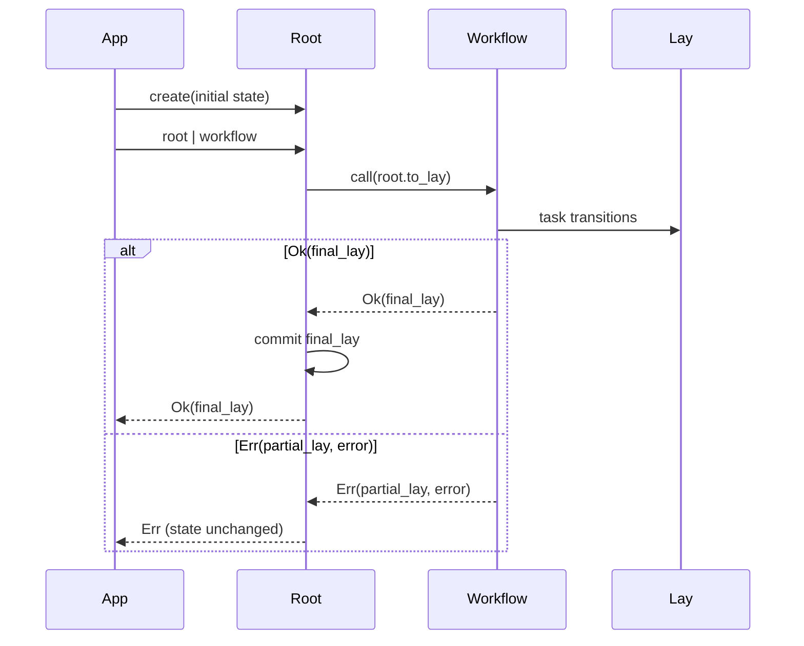

# Root and Lay

`Root` and `Lay` separate committed application state from the immutable values that flow through a
workflow.

| Type     | Responsibility                                                | Mutability                                            |
| -------- | ------------------------------------------------------------- | ----------------------------------------------------- |
| `Root`   | Owns the committed state for one workflow run                 | Advances on an explicit commit or successful workflow |
| `Lay`    | Reads and transforms a snapshot, optionally at a nested focus | Immutable; every write returns a new lay              |
| `Result` | Carries either a successful or failed lay between tasks       | Immutable value                                       |

## The lifecycle



Compose all steps before sending them to the root:

```ruby
workflow = validate >> charge >> notify
result = root | workflow
```

Avoid treating `root | validate | charge` as an atomic root execution. The first `|` returns a
`Result`, so later tasks continue from that result without another automatic root commit.

## Create and inspect a root

```ruby
root = Beryl::Root[
  request: { id: 'req_1' },
  user: { id: 1, name: 'mina' }
]

# Convenience constructor
same_shape = Beryl.root(request: { id: 'req_1' })
```

`state` and `to_h` expose the committed Ruby value. `to_lay` creates the value passed to tasks.

```ruby
root.state
# => { request: { id: 'req_1' }, user: { id: 1, name: 'mina' } }

lay = root.to_lay
lay[:user][:name].get
# => "mina"
```

## Focus and immutable updates

Each `[]` adds a path to the focus. Reads and updates operate at that path while `to_h` returns the
complete state.

```ruby
lay = Beryl::Lay[user: { id: 1, name: 'mina' }]

renamed = lay[:user][:name].update(&:upcase)
enriched = renamed[:user].put(:role, 'admin')

enriched.to_h
# => { user: { id: 1, name: 'MINA', role: 'admin' } }

lay.to_h
# => { user: { id: 1, name: 'mina' } }
```

The update operations are:

- `set(value)` replaces the value at the current focus.
- `update { |value| ... }` transforms the current value.
- `put(key, value)` sets a child of the current focus.

Task bodies should return the new lay:

```ruby
promote = Beryl::Task[:promote] do |lay|
  lay[:user].put(:role, 'admin')
end
```

## Lookup behavior

`get` is strict and raises a normal Ruby lookup error for a missing path. Use an explicit helper
when absence is expected:

```ruby
lay[:user][:name].get
lay[:nickname].maybe          # => nil
lay[:nickname].fetch('friend') # => "friend"
lay[:nickname].present?       # => false
```

`required` always returns a `Result`: `Ok(focus)` when the path resolves, or an `Err` carrying the
given code when it is missing.

```ruby
result = lay[:account_id].required(:missing_account_id)
result.code
# => :missing_account_id
```

See [Errors and recovery](error-handling.md) for how failures move through a workflow.

## Running without a root

Use `Beryl::Lay[...]` directly for unit tests or pure workflow evaluation. No external state is
committed:

```ruby
input = Beryl::Lay[user: { name: 'mina' }]
result = promote.call(input)

result.focus.to_h
# => { user: { name: 'mina', role: 'admin' } }

input.to_h
# => { user: { name: 'mina' } }
```

A `Flow` can provide the same explicit execution boundary:

```ruby
result = Beryl::Flow[Beryl::Lay[user: { name: 'mina' }]].call(promote)
```

## Commit semantics

A successful workflow run adopts its final lay. A failed run exposes its partial lay but leaves the
root unchanged.

```ruby
root = Beryl::Root[charged: false]

fail_after_charge = Beryl::Task[:fail_after_charge] do |lay|
  lay[:charged].set(true).reject(:payment_failed, 'payment failed')
end

result = root | fail_after_charge

result.focus.to_h
# => { charged: true }

root.state
# => { charged: false }
```

External observations can be committed explicitly:

```ruby
root.commit(user: { plan: 'pro' })
```

Hash commits deep-merge into the current root. Committing a complete `Lay`, `Root`, `Ok`, or `Err`
adopts that value's focus.

## Subscribe to commits

A subscriber receives the current snapshot immediately and every later commit event:

```ruby
root = Beryl::Root[count: 0]

unsubscribe = root.subscribe do |event|
  p event
end

root.commit(count: 1)
unsubscribe.call
```

Subscriptions observe commits; they do not change workflow control flow.
